# Carlstons Coffee - Website Overview

Welcome to the README for **[Carlstons Coffee]**. This document provides an overview of the website's key pages, with images.

## Table of Contents

- [Introduction](#introduction)
- [Technologies Used](#technologies-used)
- [Installation](#installation)
- [Pages Overview](#pages-overview)
  - [Home Page](#home-page)
  - [Header & Footer](#header--footer)
  - [Club Page](#club-page)
  - [Order Online Page](#order-online)
  - [Sustainability Page](#sustainability)
  - [Account Page](#account)
- [Contributing](#contributing)
- [Contact](#contact)

## Introduction

**[Carlstons Coffee]** is a website for a coffee shop. The site is designed to showcase the products and services offered by the shop and if a shop wants to do a loyalty system for it's customers then that is also provided through a membership that the customers can register for.

## Technologies Used

- **Frontend:** HTML, CSS, JavaScript, React
- **Backend:** Node.js, Express
- **Database:** PostgreSQL
- **Hosting:** GitHub Pages
- **Other Tools:** Bootstrap

## Installation

[Download the ZIP](https://github.com/Carlston325/carlstons-coffee/archive/refs/heads/main.zip)

To run this website locally, follow these steps:

1. Clone the repository: `git clone https://github.com/Carlston325/carlstons-coffee.git`
2. Navigate to the project directory: `cd carlstons-coffee`
3. Install dependencies: `npm install` (or the equivalent for your setup)
4. Start the development server: `npm start` (concurrently is installed so both react and server is launched)
5. Open your browser and go to `http://localhost:3000`

## Pages Overview

### Home Page

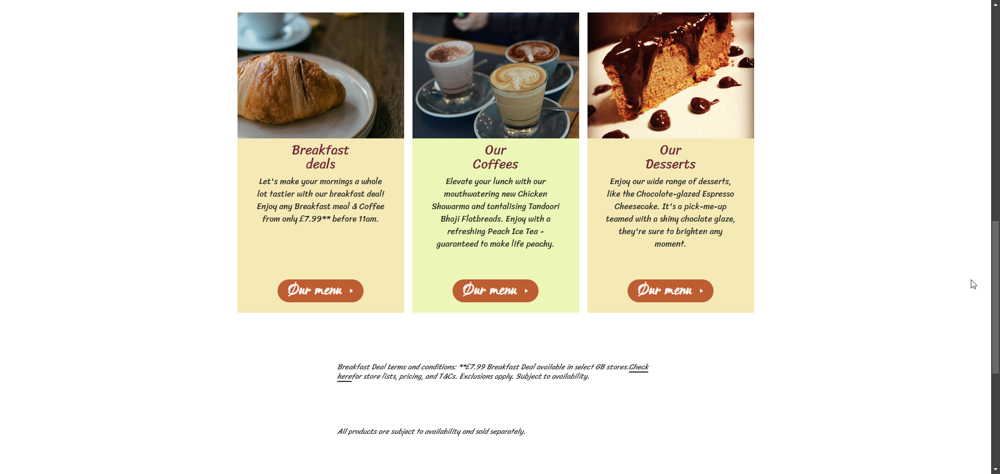

### Header & Footer

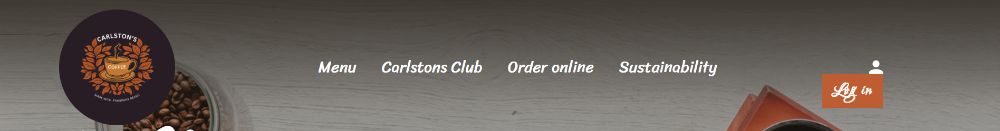
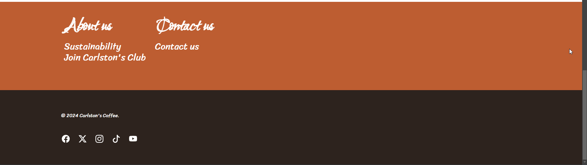

### Club Page

### Order Online

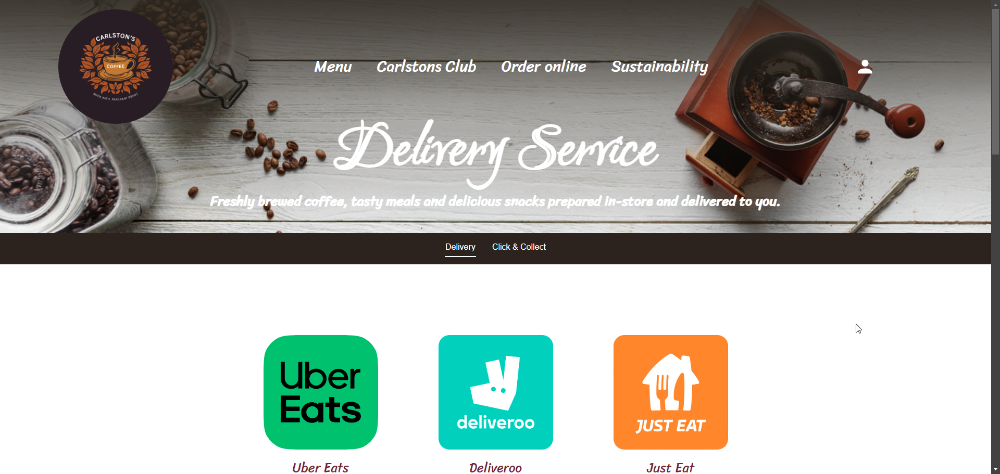
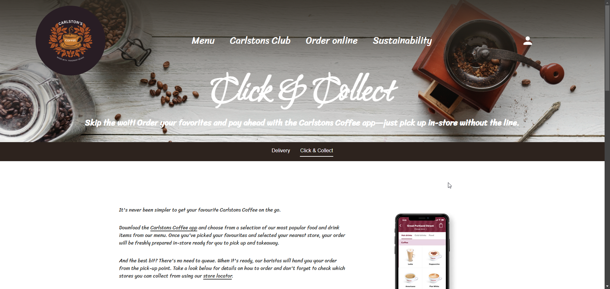

### Sustainability

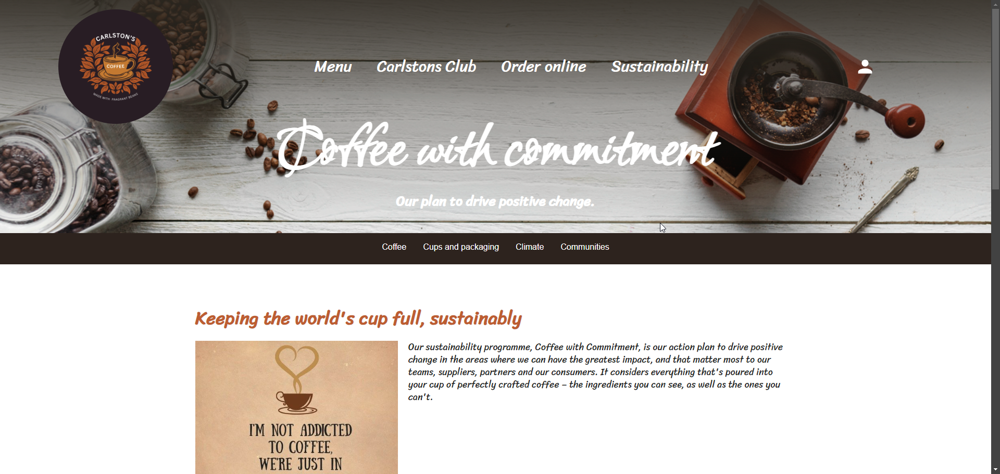
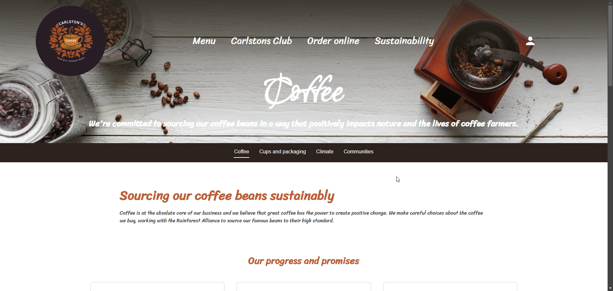
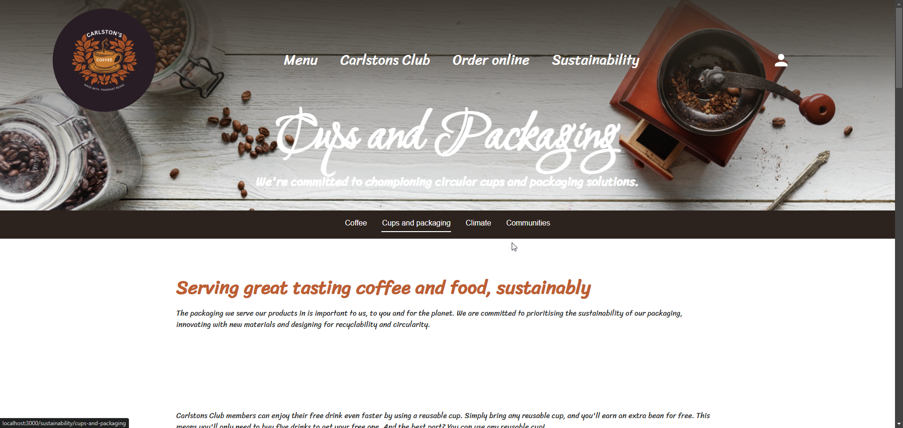
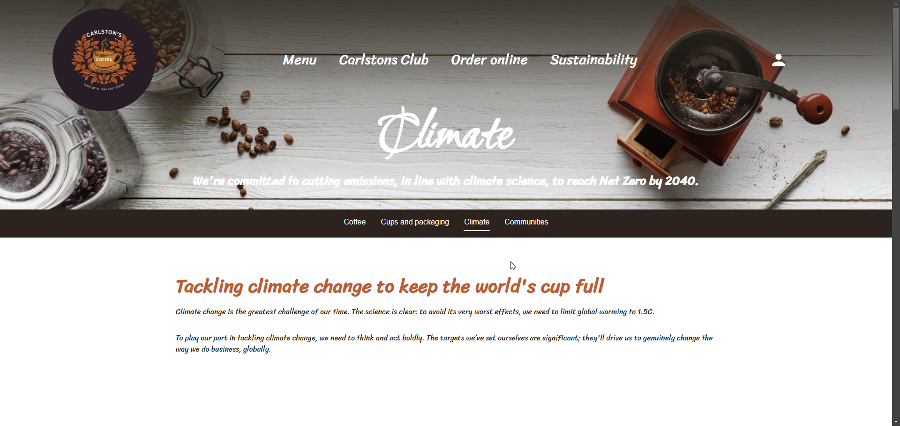
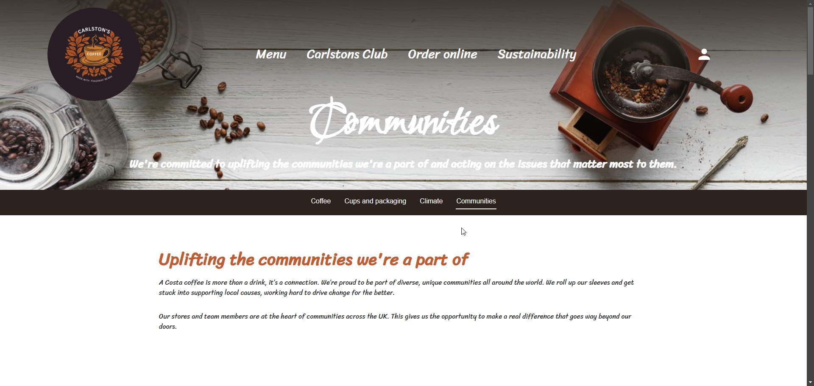

### Account

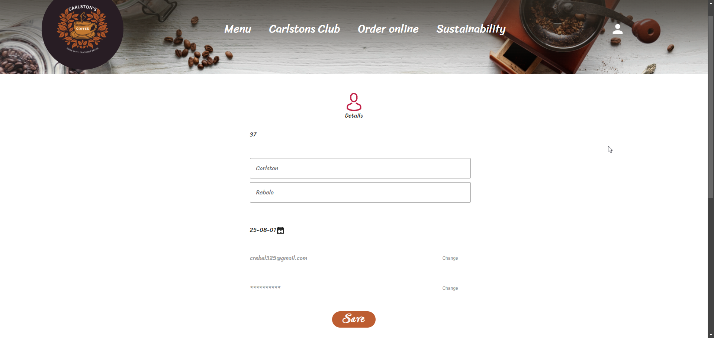
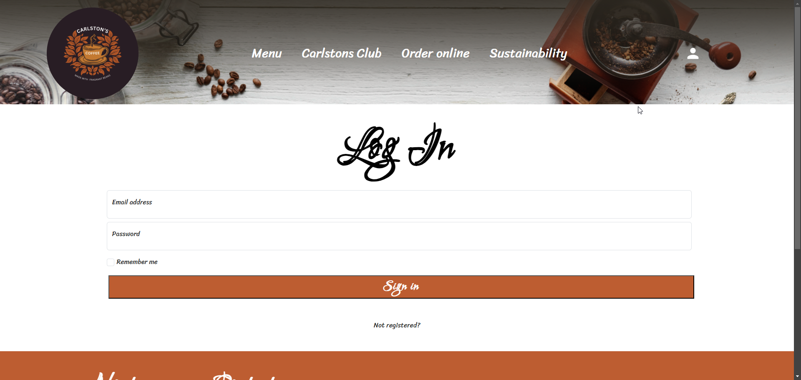
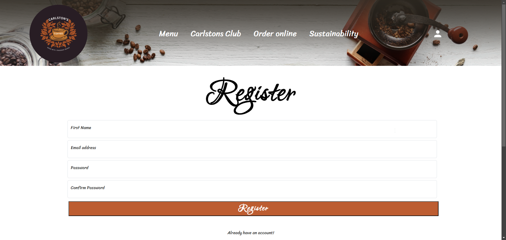

## Contributing

Contributions are welcome! Please follow these steps to contribute:

1. Fork the repository
2. Create a new branch (`git checkout -b feature-branch`)
3. Make your changes
4. Commit your changes (`git commit -m 'Add some feature'`)
5. Push to the branch (`git push origin feature-branch`)
6. Open a pull request

## Contact

For any inquiries or feedback, please contact us [here](mailto:crebel325@gmail.com).

---
